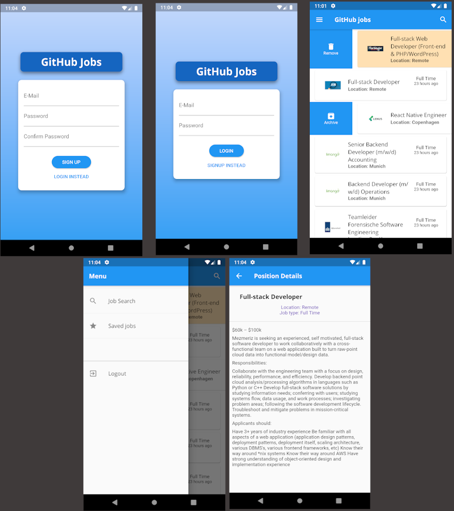

# GitHubJobs demo app
A showcase demo app using [GitHub Jobs API](https://jobs.github.com/api) for fetching jobs and using [Firebase](https://firebase.google.com/) for user authentication/registration as well as keeping user favorite jobs saved.
Authentication is also automatic if the user wasn't logged out by token expiry or if it was done manually.

**What is left?**
Add filtering options and the option to save the job item from the detail page.
Find and implement a way to save and display saved jobs, unsure if to be done locally or remotely and how exactly to do it.

Additional dependencies used:
 - http: ^0.12.2
 - provider: ^4.3.2+1
 - shared_preferences: ^0.5.10
 - intl: ^0.16.1
 - jiffy: ^3.0.1
 - flutter_markdown: ^0.4.3
 - flutter_slidable: ^0.5.5

## Screenshot

